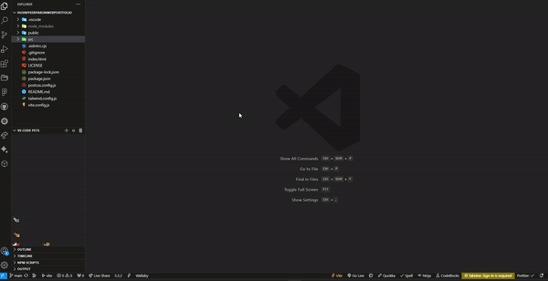

# HusniyeErparunWebPortfolio


## Description
This project showcases my proficiency in both front-end and backend development. It offers opportunities to present solo or collaborative projects, illustrating a diverse skill set. It serves as a comprehensive demonstration of my varied development skills

## Table of Contents
* [Description](#description)
* [Deployment](#deployment)
* [Demo](#demo)
* [Screenshot](#screenshot)
* [Languages](#languages)
* [Usage](#usage)
* [Contributors](#contributors)
* [Testing](#testing)
* [Author](#author)
* [Repository](#repository)
* [Questions](#questions)

## Deployment
https://husniyeerparunportfolio.netlify.app 
```npm install```
## Demo

## Screenshot
<p> Gifs</p>


<p> Screenshot  </p>


## Languages
HTML, CSS, JavaScript, React, Tailwind
## Usage
This project can be used Highlighting expertise in front-end languages, this project demonstrates advanced skills in React and other frameworks. The showcase emphasizes versatility and proficiency, illustrating a well-rounded approach to development with a focus on cutting-edge technologies.
## Installation
Install HusniyeErparunWebPortfolio with  vite```npm create vite@latest``` npm ```npm install```  React Router ```npm i react-router-dom``` React Icons  ```npm install react-icons --save``` type animation ```npm i react-type-animation``` Tailwind ```npm install -D tailwindcss postcss autoprefixer``` Tailwind css  ```npx tailwindcss init -p``` React hero icons ````npm install @headlessui/react @heroicons/react```
## Contributors
Contributions are always welcome!
## Tests
n/a
## Author
[@tigerkaplan](https://github.com/tigerkaplan)
## Repository
https://github.com/tigerkaplan/HusniyeErparunWebPortfolio
## Questions
Please send your questions [here](mailto:husniyeerparun@gmail.com	?subject=[GitHub]%20Dev%20Connect) or visit [github/tigerkaplan](https://github.com/tigerkaplan) for my other projects on GitHub.
